# Table of Contents
* Abstract
* [Introduction](#1-introduction)
* [Related Work](#2-related-work)
* [Technical Approach](#3-technical-approach)
* [Evaluation and Results](#4-evaluation-and-results)
* [Discussion and Conclusions](#5-discussion-and-conclusions)
* [References](#6-references)

# Abstract

Computing the angles of tilt for a device serves various purposes in the realms of human motion tracking and virtual reality. Conventional approaches involve integrating data from accelerometers, magnetometers, and gyroscopes to fuse sensor information. Nonetheless, gyroscopes are more demanding in terms of power consumption and cost when compared to the aforementioned sensors. In this project,I employed a machine learning approach on Arduino Nano 33 BLE Rev2 to attain accurate inclination estimation, leveraging data from accelerometers, magnetometers, and a limited number of gyroscope samples. 

# 1. Introduction

* Motivation & Objective

An Inertial Measurement Unit (IMU) is important for various applications, particulary in the fields of robotics, virtual reality and wearable technology. IMUs play a crucial role in providing valuable information about motion sensing. However, gyroscopes are more expensive and power hungry compared to accelerometers and magnetometers. In IoT, power consumption is a critical concern and the project aims to reduce power consumption by using alternative sensors to mimic a gyro's functionality to make IoT devices more energy-efficient. Machine learning method is used for accurate inclination estimation based on accelerometers and magnetometers and limited number of gyro samples.

* State of the Art & Its Limitations

Accelerometers and magnetometers based gyroscope emulation is studied for a long time while all of the algorithms are based on mathematical derivation and physical modeling,which requires the data is highly accurate and noise free, especially for magnetometers. Hard-iron offset elimination is proposed for tilt-compensation but the algorithm is still not robust for accurate inclination estimation.

* Novelty & Rationale

In this undertaking, I introduced a machine learning approach aimed at estimating inclination angles by utilizing accelerometers, magnetometers, and a limited set of gyroscope data. It has been demonstrated that accelerometers and magnetometers possess the capability to reconstruct gyroscope information, and a small set of gyroscope samples contributes to the overall robustness of the emulation process. When compared to model-based techniques, machine learning exhibits enhanced accuracy and resilience to noise. Similar works have done in other areas, such as computer vision, using key frames to reconstruct higher resolution pictures give low resolution input.

* Potential Impact

For practical situations, this project offers a sulution to achive highly-accurate inclination estimation with low power consumption due to limited gyro's samples. It can be used in motion sensing, robotics, virtual reality and wearale devices and extend the life of IoT devices.

* Challenges

Data collection is really important in this project. There is no suitable dataset online to train the machine learning model to reconstruct gyroscopes. I need to collect the data using Arduino Nano 33 Sense Rev2. The data collected will be noisy and suffer from drift and the environment, which means calibration is required and the quality of the calibration directly inference the traning result. Another challenge is the machine learning model design and the computation time is cruicial in a real-time system for inclination estimation. The machine learning model should be carefully design to make sure to find the balance between the estimation accuracy and the computation time.

* Requirements for Success

In order to perform the project, a reliable data set is required for the training phase due to there is no suitable public data set online. I have to collect the data using Arduino Nano 33 Sense Rev2 after clibration. Also a great understand of physical model is required to better design the neural network.

For skills required for this project, the core skill is to design a neural network that can achieve accurate inclination estimation with low computational complexity. Also implementing the machine learning model using Arduino Nano 33 Sense Rev2 and run the model in real-time is required.

* Metrics of Success

In this project, the metrics of success are based on inclination estimation accuracy. The angles of inclination fusing accelerometers, magnerometers and gyroscopes can be treated as groud truth. Estimated inclination can be obtained using machine learning model. We can determine whether an accurate estimation is made based on mean absolute error and the computation time required for the estimation.

# 2. Related Work

A conventional IMU comprises gyroscope, accelerometer and magnetometer, in order to get the pose estimation. However, gyroscopes are afflicted with bias drift, shock resistance and durability, also it is the most power consuming and expensive components among all the IMU sensors. Multiple methods are proposed to use accelerometers and magnetometers to mimic the gyroscope's functionality.

A gyroscope-free IMU that only consists of accelerations sensors is presented in [9] to complete relative body movement only by accelerometers.It intends to first overcome the mentioned disadvantages of gyroscopes and second, to reduce the total system cost by using already existing accelerometers as for example in a car. At least six accelerometers are necessary to completely determine the relative motion of a body. However, this minimum number of accelerometers is only feasible in a certain cube configuration of the sensors. Furthermore, using six sensors only the angular and the transversal acceleration can be detected. The angular velocity has to be computed via an integration step, which leads to drift errors. Authors' approach, using 12 sensors, makes it possible to determine the angular rate directly and also permits a nearly arbitrary placement of the sensors. But, with a gyro-free-IMU it is not possible to directly calculate the sign of the angular movement. To overcome this drawback, an Un- scented Kalman Filter (UKF) is applied to merge the information of the angular acceleration and the angular rate and thus robustly estimate the sign of the body’s rotation.

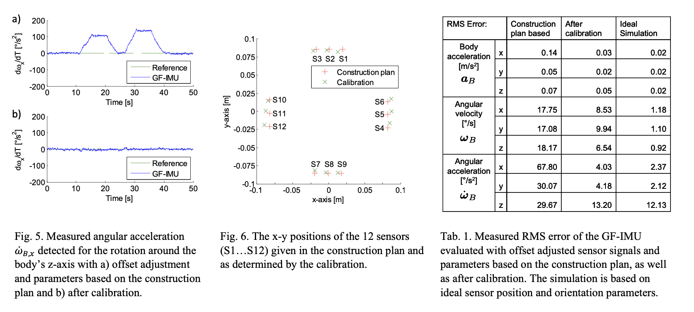

The accuracy of the IMU after calibration is compared to the results using positions and orientations given in the construction plan and to a simulation based on ideal parameters. For the evaluation based on the construction plan, a simple offset adjustment of the sensor signals has been applied, since this is a standard calibration procedure. However, the method is not realistic in real systems because only 3-axis acceleration is obtainable in IMU, while in this paper, 12 accelerometers are used to estimate the pose.

Another approach is proposed in [3] to use accelerometer and magnetometer to emulate gyroscope's functionality based on physical models. Authors proposed two methods to reconstruct the gyro, the first one relies on Tait-Bryan angles and quaternions, the second approach is based on Rotation Matrix. The computation process of the first approach is shown in the following:

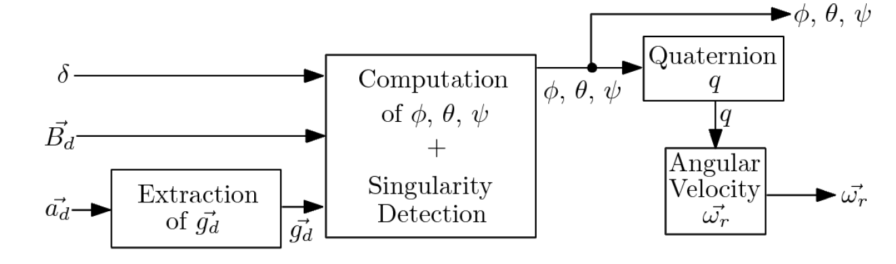

In this approach, the angles of inclination of the device and the angular velocity are computed from the accelerometer and the magnetometer measurementss using Tait-Bryan angles and quaternions. It has low computation cost, but the major disadvantage of this method is that it has 8 singularities to check and it requre the explicit computation of the angles. The authors proposed another algorithm based on Rotation Matrix and quaternions to reduce the number sigularities and address the problem of  explicit computation of angles. The computation process of this approach is shown in the following:

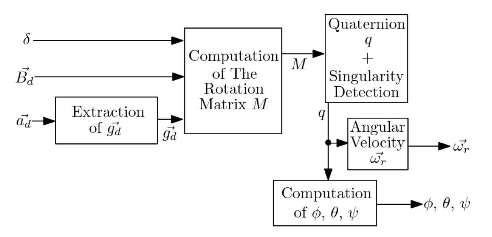

The experimental results of the angular velocity computed with their first method is compared to the measurements from a real gyroscope.The results are shown as follows. Also a basic virtual reality application is developed to test the emulation result.

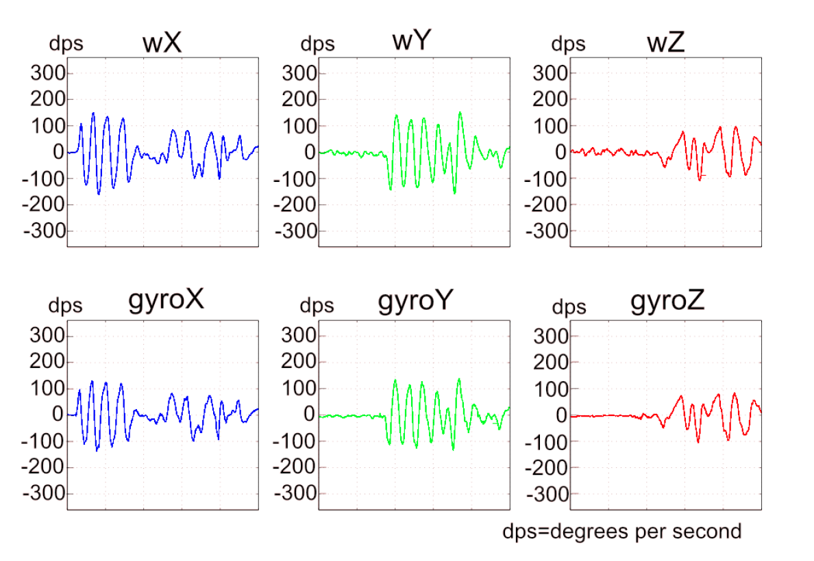

Machine learning approach is widely used, especially in computer vision to reconstruct high quality images from low resulution pictures. In [1], they heavily duty cycle the high power mode of the camera to output an images only once every second and proposed a machine learning model to reconstrct the video with grey-scale, low resolution camera. To achieve this, they introduced an attention feature filter mechanism that assigns different weights to different features, based on the correlation between the feature map and the contents of the input frame at each spatial location. The architecture of the machine learning model is shown as follows:

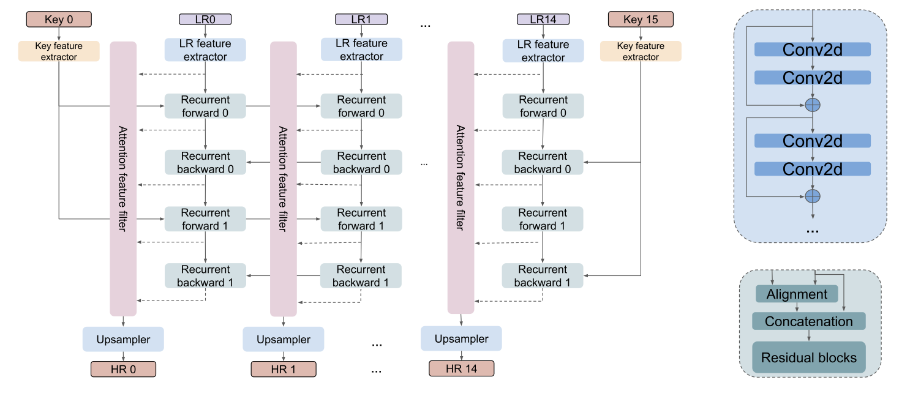

# 3. Technical Approach

The technical approach to this project can be mainly divided into 4 steps: Data collection and Calibration, Model design and training, Arduino Nano 33 deployment and Visualization.

(1) Data Collection and Calibration：

The data collection part contains 2 seperate dataset, including one training dataset and one calibration dataset. The calibration dataset is collected while ensuring the IMU is in a static and stable position, which means no movement or vibration. I recorded the sensor readings from accelerometers, gyroscopes and magnetometers in all three axes while the IMU is stationary. The calibration data will be used to determine the sensor biases to eliminate the drifting of the accelerometer and gyroscope and the hard-iron effect of the magnetometer. In total, 15712 data samples are collected for sensor calibration.

The training dataset is collected while ensuring the IMU is randomly moving and rotating. The sensor readings from the accelerometers, gyroscopes and magnetometers as well as the inclination angle(pitch, roll, yaw) estimated using kalman filter is recorded for the training process. In total, 15784 data samples are collected for sensor calibration.

(2) Model Design and Training:

After the calibrate the sensors, the training data can be used for model training. The model is trained using Tensorflow and will deploy to Arduino Nano 33 BLE Rev2. The input data consists 3-axes current accelerometer readings, 3-axes current magnetometer readings and 3-axes previous gyroscope readings(real reading or estimated data). The output is the estimated current 3-axes current gyroscope estimation. The input previous gyroscope data can be treated as starting point, and the current accelerometer reading and magnetometer reading is regarded as the controller of the system. The input data is fed into each of the three fully connected neural networks based on the different sensor types and passed together through the same fully connected neural network, which then outpus the estimated gyroscope values. The model is trained on Nvidia RTX 3070Ti. 

(3) Arduino Nano 33 Deployment:

After building and training the Tensorflow model, the pretrained model is converted to TensorFlow Lite and then encoded the model in an Arduino header file. The model is then deployed on Arduino Nano 33 and take the current acceleration and current magnetometer readings as well as the previous gyro estimation. The output is the estimation of current gyro. The output data can be use in visualization and for further analysis.

(4) Visualization:

The inclination angles using sensor readings and the output of the neural network can be used in Processing for visualization, to illustrate the performance of the output data.

# 4. Evaluation and Results

(1) Calibration Results:

In order to get accurate accelerometer and magnetometer readings, calibration is required to eliminate the drifting and the hard-iron effect. The calibration result is shown as follows:

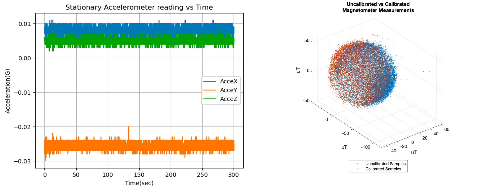

According to the calibration result, the acceleration offsets for three axes are 0.008g, -0.026g and 0.005g,respectively. The gyroscope offsets for three axes are -0.025dps,-0.1138dps and 0.0397dps, respectively. The magnetometer calibration should be done when moving the hardware to another place because it highly depends on the environment.

(2) Model Analysis:

The model performance is evaluated given the previous gyro reading or estimation, current accelerometer and magnetometer readings. One step result is shown in the following. One step estimation can reduce the gyro usage to 50%, and can accuratelt track the real gyro readings.

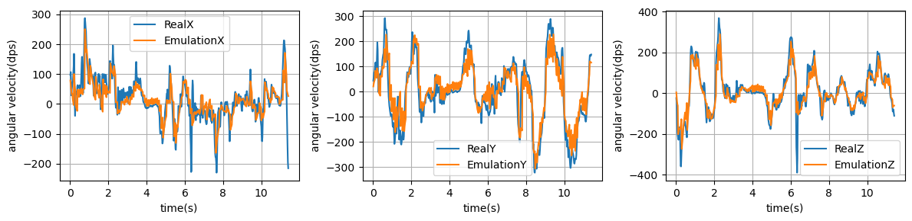

However, when I increase the number of steps for the model to estimate, the estimation error will quickly accumulate and affect the estimation accuracy. The CDF figure and the box figure is shown in the following:

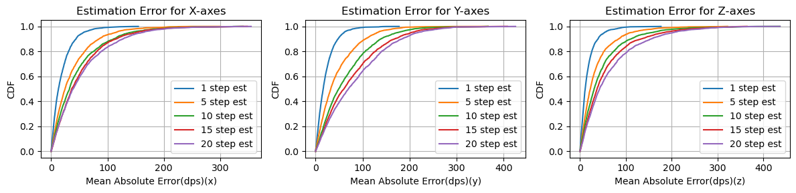

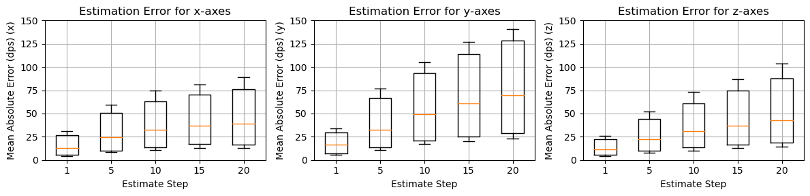

The figure clearly illustrates that the estimation error is significantly greater along the Y-axes compared to the X-axes and Z-axes. In one-step prediction for the X and Z-axes, the angular velocity estimation error is approximately 15 degrees per second (dps), and with an increasing number of steps, it converges to around 40 dps. In contrast, for one-step prediction along the Y-axes, the angular velocity estimation error is approximately 19 dps, and as the number of steps increases, it converges to around 75 dps.

(3) Hardware deployment and Visualization:

In this part the performance of the virtual gyro is evaluated on Arduino Nano 33BLE Rev2 board and Processing is used for visualization. The visualization results at the initial point and the end point are shown as follows and it used 5-step emulation to estimate the gyro-scope readings. The figure on the left-hand side represents the real inclination angles calculated from the filter and the right-hand side figure represents the inlication angles based on the virtual gyro emulation.

The Initial Point

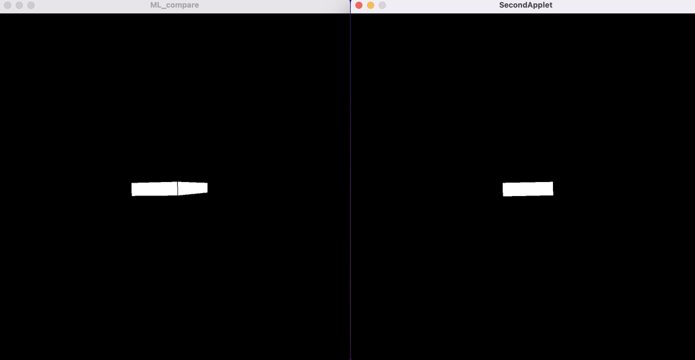

The End Point

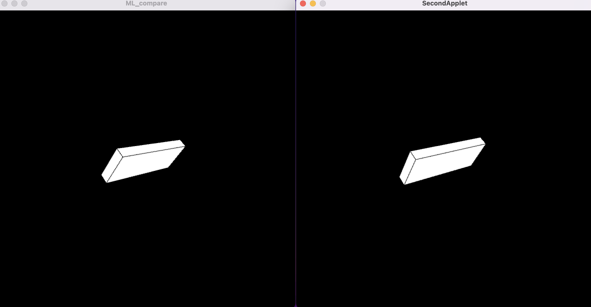

# 5. Discussion and Conclusions

Accelerometers and magnetometers have the ability to reproduce gyroscopes due to the erdundant degrees of freedom in the IMU. Physical model based methods are proposed to solve the problem. In this project, I proposed an approach using machine learning and low-sample-rate gyro value to emulate virtual gyroscope. The experimental results showed that the proposed method can approximately reconstruct the gyroscope, given a reasonable step value. Also, more complicated model can be used to emulate the output data and the time-dependency of the input data can be better ultilized. Another interesting problem that is worth exploring is that the computational complexity for computing the virtual gyro.

# 6. References
[1]Bandhav Veluri, Collin Pernu, Ali Saffari, Joshua Smith, Michael Taylor, and Shyamnath Gollakota. 2023. NeuriCam: Key-Frame Video Super-Resolution and Colorization for IoT Cameras. In Proceedings of the 29th Annual International Conference on Mobile Computing and Networking (ACM MobiCom '23). Association for Computing Machinery, New York, NY, USA, Article 26, 1–17. https://doi.org/10.1145/3570361.3592523

[2]Zhang, Yifan, William W. Clark, Bryan Tillman, Young Jae Chun, Stephanie Liu, and Sung Kwon Cho. 2023. "A System to Track Stent Location in the Human Body by Fusing Magnetometer and Accelerometer Measurements" Sensors 23, no. 10: 4887. https://doi.org/10.3390/s23104887

[3]Baptiste Delporte, Laurent Perroton, Thierry Grandpierre, Jacques Trichet. Accelerometer and Magnetometer Based Gyroscope Emulation on Smart Sensor for a Virtual Reality Application. Sensors & Transducers., 2012, 14-1 (Special Issue ISSN 1726-5479), p32-p47. ⟨hal-00826243⟩

[4]Q. Liu et al., "Gazelle: Energy-Efficient Wearable Analysis for Running," in IEEE Transactions on Mobile Computing, vol. 16, no. 9, pp. 2531-2544, 1 Sept. 2017, doi: 10.1109/TMC.2016.2623304.

[5]Ludwig, Simone A., and Antonio R. Jiménez. "Optimization of gyroscope and accelerometer/magnetometer portion of basic attitude and heading reference system." 2018 IEEE International Symposium on Inertial Sensors and Systems (INERTIAL). IEEE, 2018.

[6]Wu, Yuanxin, and Ling Pei. "Gyroscope calibration via magnetometer." IEEE Sensors Journal 17.16 (2017): 5269-5275.

[7]Yu, Hongnian, Shuang Cang, and Yan Wang. "A review of sensor selection, sensor devices and sensor deployment for wearable sensor-based human activity recognition systems." 2016 10th international conference on software, knowledge, information management & applications (skima). IEEE, 2016.

[8]Liu, T., G. R. Zhao, and S. Pan. "New calculating method of angular velocity in gyroscope-free strapdown inertial navigation systems." Systems Engineering and Electronics 32.1 (2010): 162-165.

[9]Schopp, P., et al. "Sensor fusion algorithm and calibration for a gyroscope-free IMU." Procedia Chemistry 1.1 (2009): 1323-1326.

[10]Wang, C., et al. "Hybrid algorithm for angular velocity calculation in a gyroscope-free strapdown inertial navigation system." Journal of Chinese Inertial Technology 18.4 (2010): 401-404.
